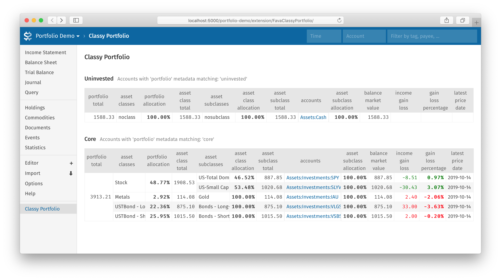

# Fava Classy Portfolio Extension

## Warning: Prototype Code
This is a prototype I'm throwing out there due to interest from the Beancount Community (see https://groups.google.com/forum/#!msg/beancount/XNjjnML_vsA/e_MAEhgCBgAJ ). It requires the latest dev revision of [fava](https://github.com/beancount/fava) (specifically newer than [2019-11-23](https://github.com/beancount/fava/commit/4d977c98ad07bff924da7c290b78ee9121e2bf38)).

Issues / PR's welcome! So far this is just an early prototype to get a table breakdown view done, there's still work to be done on numeric features (e.g. gain/loss, tax, etc.).

## Introduction
Classy Portfolio is an Extension for Fava, a web interface for the Beancount plaintext accounting software. The extension displays a list of different portfolios (e.g. 'taxable' vs. 'retirement'), with breakdowns using 'asset-class' and 'asset-subclass' metadata labels on commodities.

It's recommended (though not required) to use this extension along with the [beancount metadata spray plugin](https://github.com/seltzered/beancount-plugins-metadata-spray) to ease with tagging multiple accounts with portfolio metadata.

An example file is available at https://github.com/seltzered/fava-class-portfolio-demo.

## Usage

1. Clone this repo into the same directory as your beancount ledger.

2. In your ledger file, add asset-class and asset-subclass metadata strings to commodity entries. Should look similar to: 

        2010-01-01 commodity VTI
          name: "Vanguard Total Market Index ETF"
          asset-class: "Stock"
          asset-subclass: "US-Total Domestic Market"
          price: "USD:yahoo/VTI" 

3. In your ledger file, add portfolio metadata strings to account entries. Should look similar to:

        2010-01-01 open Assets:Vanguard:RothIRA:VTI
            portfolio: "retirement"
    ...or if you're using the metadata spray plugin:

        2010-01-01 open Assets:Vanguard:RothIRA:VTI
        plugin "beancount_plugins_metadata_spray.plugins.metadata_spray" "{
        'sprays': [{ 'spray_type': 'account_open',
                      'replace_type': 'return_error',
                      'pattern': 'Assets:Vanguard:RothIRA:.*',
                      'metadata_dict': {'portfolio': 'retirement'}
                      }]
        }"

4. In your ledger file, instantiate the extension with a line similar to:

        2010-01-01 custom "fava-extension" "fava_classy_portfolio" "[
                ('account_open_metadata_pattern', ('portfolio', 'retirement'))
        ]"

5. Because this is an early prototype, you will need to clone/run fava from latest source. See first section "PROTOTYPE: modification to fava required" in this document on modifying fava.

6. Run fava on the ledger file. A link in the sidebar should appear.

## References

This extension was somewhat inspired by the [Beancount Portfolio Allocation](https://github.com/ghislainbourgeois/beancount_portfolio_allocation) plugin, which I believe follows similar conventions on metadata labeling.
